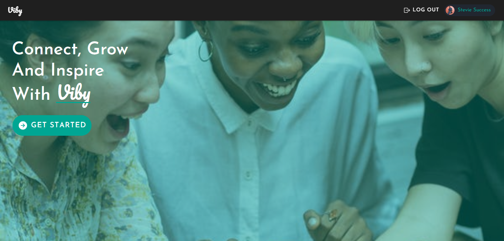
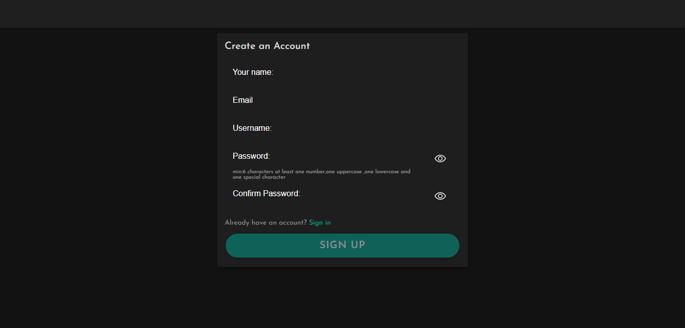
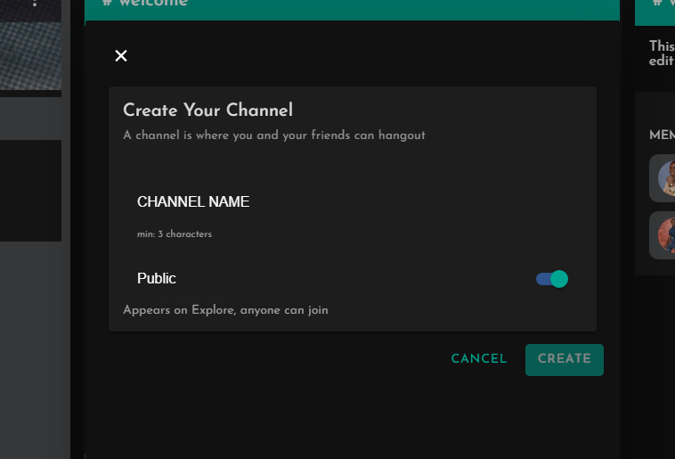
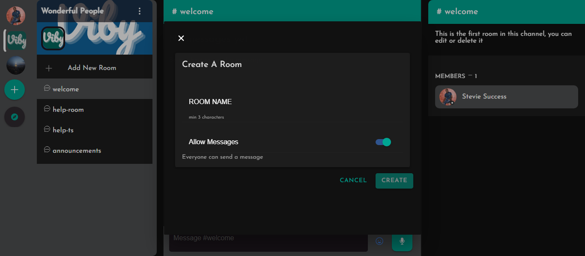
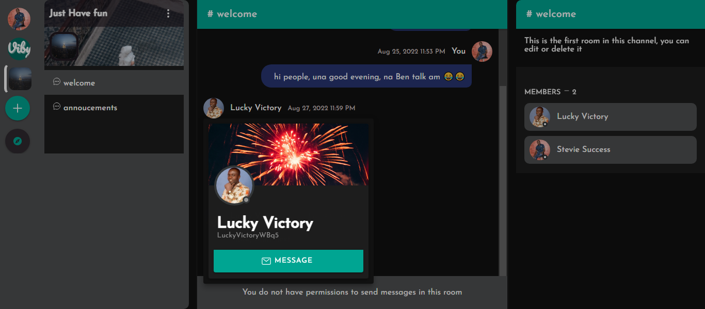
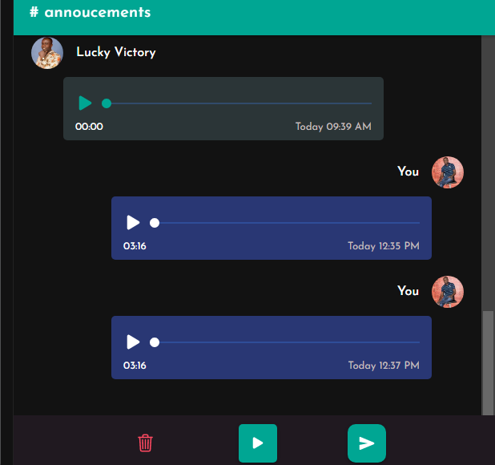
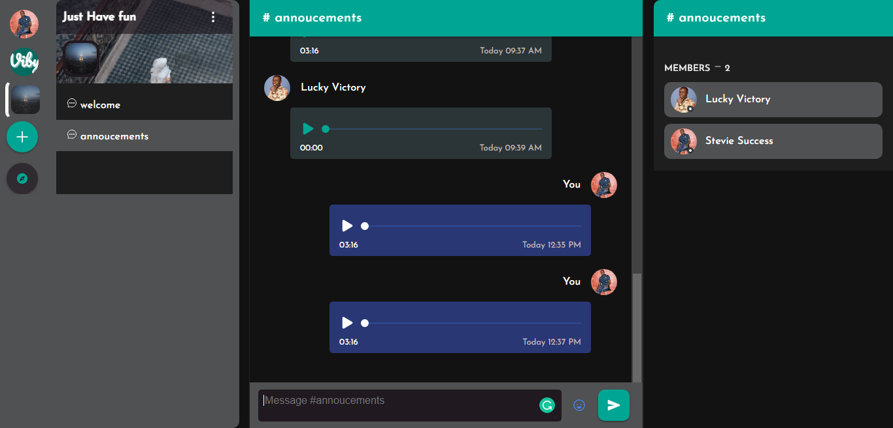

# Viby - discord-like chat app

Viby is a discord-like chat application but with audio message like WhatsApp

### Homepage



### Sign up page



### create channel preview



### create room preview



### profile preview



### Audio preview

you can play your audio message before sending


### chat preview



### chat options preview

you can edit, copy and delete a message


# Overview video (Optional)

Here's a short video that explains the project and how to use it:

[](https://youtu.be/pES-meKPwVE)

## How it works

Viby consist of two parts,

- Frontend: Built with Angular and Ionic, uses an API and web socket (socket.io) to interact with the backend.
- Backend: Uses RedisJSON and RedisSearch for storage, and exposes endpoints for the frontend to interact with, as well web socket (socket.io);

### How the data is stored:

The data is stored using RedisJSON,
it uses node redis-om to store data
in form of Entities, Each `Entity` is accessed through a `Repository`,

which are as follows:

- MessagesRepo: This repo controls the message entities
  - MessageEntity: this entity handles messages,

```js
const MessagesSchema = new Schema(MessagesEntity, {
  user_id: { type: "string" },
  content: { type: "text", sortable: true },
  attachments: { type: "string[]" },
  type: { type: "string" },
  message_id: { type: "string" },
  room_id: { type: "string" },
  channel_id: { type: "string" },
  status: { type: "string" },
  created_at: { type: "date", sortable: true },
});

export const MessagesRepo: Promise<Repository<MessagesEntity>> = (async () => {
  const repo = await (await client).fetchRepository(MessagesSchema);
  await repo.createIndex();
  return repo;
})();
```

- RoomsRepo: This repo controls the room entities
  - RoomEntity: this entity handles rooms,

```js
const RoomsSchema = new Schema(RoomsEntity, {
  channel_id: { type: "string" },
  title: { type: "text", sortable: true },
  description: { type: "text", sortable: true },
  room_id: { type: "string" },
  owner_id: { type: "string" },
  members: { type: "string[]" },
  message_allowed: { type: "boolean" },
  created_at: { type: "date", sortable: true },
});

export const RoomsRepo: Promise<Repository<RoomsEntity>> = (async () => {
  const repo = await (await client).fetchRepository(RoomsSchema);

  await repo.createIndex();
  return repo;
})();
```

- ChannelsRepo: This repo controls the channel entities
  - ChannelEntity: this entity handles channels,

```js
const ChannelsSchema = new Schema(ChannelsEntity, {
  channel_id: { type: "string" },
  title: { type: "text", sortable: true },
  description: { type: "text", sortable: true },
  owner_id: { type: "string" },
  rooms: { type: "string[]" },
  is_public: { type: "boolean" },
  channel_picture: { type: "string" },
  channel_cover: { type: "string" },
  created_at: { type: "date", sortable: true },
  members: { type: "string[]" },
});

export const ChannelsRepo: Promise<Repository<ChannelsEntity>> = (async () => {
  const repo = await (await client).fetchRepository(ChannelsSchema);
  await repo.createIndex();
  return repo;
})();
```

- UsersRepo: This repo controls the user entities
  - UserEntity: this entity handles users,

```js
const UsersSchema = new Schema(UsersEntity, {
  user_id: { type: "string" },
  username: { type: "text", sortable: true },
  fullname: { type: "text", sortable: true },
  email: { type: "string" },
  password: { type: "string", sortable: false },
  profile_picture: { type: "string" },
  cover_picture: { type: "string" },
  created_at: { type: "date", sortable: true },
  bio: { type: "text" },
  status: { type: "string" },
  friends: { type: "string[]" },
});

export const UsersRepo: Promise<Repository<UsersEntity>> = (async () => {
  const repo = await (await client).fetchRepository(UsersSchema);

  await repo.createIndex();
  return repo;
})();
```

### How the data is accessed:

The data is accessed through each repo instance,
it uses the `search()` method of `redis-om` to access data,
for instance:
To create a new channel,

```js
await ChannelsRepo.createAndSave(newChannel);
```

To query a channel

```js
const channel = await ChannelsRepo.search()
  .where("channel_id")
  .equal(channelId)
  .returnFirst();
```

To query multiple channels

```js
const channels = await ChannelsRepo.search()
  .where("channel_id")
  .equal(channelId)
  .returnAll({ pageSize: 100 });

// or
const channels = await ChannelsRepo.search()
  .where("is_public")
  .is.true()
  .page(offset, limit);
```

To remove/delete a channel, query the channel and use `remove()` method, passing in the channel's `entityId`,

> **Note:**`entityId` is autogenerated by redis-om

```js
const channel = await ChannelsRepo.search()
  .where("channel_id")
  .equal(channelId)
  .returnFirst();

await ChannelsRepo.remove(channel.entityId);
```

## How to run it locally?

> Before running the app locally, make sure you have Typescript installed, if not, then run this command `npm i -g typescript` to install it globally.

Then,

```
git clone https://github.com/lucky-victory/viby.git
```

The repo consist of two main folders `frontend` and `backend`,

You will have to set up the `backend` first before the `frontend`, so run the following commands

```
cd backend
cp .env.example .env

```

you will need to set up the following environment variables
**REQUIRED**

- REDIS_DB_URL: a valid redis url for your redis instance, _Note: it should contain username and password parts_.

- JWT_SECRET: this could be a string of any value, it is used as a secret to generate a JWT token

**OPTIONAL**

- JWT_EXPIRATION: Expiration time for the JWT token, default is '5m' (5mins)
- CLOUDINARY_URL: this is needed to process the audio files, if you just want to send text message, you can skip this
- ALLOWED_ORIGIN: CORS setting, default is '\*'

once all is done, run

```
npm install
npm run dev
```

This will startup the server at http://localhost:3300

Now move to the frontend

```
cd ..
cd frontend
# move into src folder and update the environment.ts
# and update apiBaseUrl and socketUrl
```

```js
{
    apiBaseUrl:'http://localhost:3300',
    socketUrl:'http://localhost:3300/socket'
}
```

Now run `npm run start`, the application would be started at http://localhost:4200

### Prerequisites

- Typescript v4 or newer
- Node: v14 or newer
- npm: v8 or newer

### Local installation

## Deployment

To make deploys work, you need to create free account on [Redis Cloud](https://redis.info/try-free-dev-to)

### Google Cloud Run

[Insert Run on Google button](https://cloud.google.com/blog/products/serverless/introducing-cloud-run-button-click-to-deploy-your-git-repos-to-google-cloud)

### Heroku

[Insert Deploy on Heroku button](https://devcenter.heroku.com/articles/heroku-button)

### Netlify

[Insert Deploy on Netlify button](https://www.netlify.com/blog/2016/11/29/introducing-the-deploy-to-netlify-button/)

### Vercel

[Insert Deploy on Vercel button](https://vercel.com/docs/deploy-button)

## More Information about Redis Stack

Here some resources to help you quickly get started using Redis Stack. If you still have questions, feel free to ask them in the [Redis Discord](https://discord.gg/redis) or on [Twitter](https://twitter.com/redisinc).

### Getting Started

1. Sign up for a [free Redis Cloud account using this link](https://redis.info/try-free-dev-to) and use the [Redis Stack database in the cloud](https://developer.redis.com/create/rediscloud).
1. Based on the language/framework you want to use, you will find the following client libraries:
   - [Redis OM .NET (C#)](https://github.com/redis/redis-om-dotnet)
     - Watch this [getting started video](https://www.youtube.com/watch?v=ZHPXKrJCYNA)
     - Follow this [getting started guide](https://redis.io/docs/stack/get-started/tutorials/stack-dotnet/)
   - [Redis OM Node (JS)](https://github.com/redis/redis-om-node)
     - Watch this [getting started video](https://www.youtube.com/watch?v=KUfufrwpBkM)
     - Follow this [getting started guide](https://redis.io/docs/stack/get-started/tutorials/stack-node/)
   - [Redis OM Python](https://github.com/redis/redis-om-python)
     - Watch this [getting started video](https://www.youtube.com/watch?v=PPT1FElAS84)
     - Follow this [getting started guide](https://redis.io/docs/stack/get-started/tutorials/stack-python/)
   - [Redis OM Spring (Java)](https://github.com/redis/redis-om-spring)
     - Watch this [getting started video](https://www.youtube.com/watch?v=YhQX8pHy3hk)
     - Follow this [getting started guide](https://redis.io/docs/stack/get-started/tutorials/stack-spring/)

The above videos and guides should be enough to get you started in your desired language/framework. From there you can expand and develop your app. Use the resources below to help guide you further:

1. [Developer Hub](https://redis.info/devhub) - The main developer page for Redis, where you can find information on building using Redis with sample projects, guides, and tutorials.
1. [Redis Stack getting started page](https://redis.io/docs/stack/) - Lists all the Redis Stack features. From there you can find relevant docs and tutorials for all the capabilities of Redis Stack.
1. [Redis Rediscover](https://redis.com/rediscover/) - Provides use-cases for Redis as well as real-world examples and educational material
1. [RedisInsight - Desktop GUI tool](https://redis.info/redisinsight) - Use this to connect to Redis to visually see the data. It also has a CLI inside it that lets you send Redis CLI commands. It also has a profiler so you can see commands that are run on your Redis instance in real-time
1. Youtube Videos
   - [Official Redis Youtube channel](https://redis.info/youtube)
   - [Redis Stack videos](https://www.youtube.com/watch?v=LaiQFZ5bXaM&list=PL83Wfqi-zYZFIQyTMUU6X7rPW2kVV-Ppb) - Help you get started modeling data, using Redis OM, and exploring Redis Stack
   - [Redis Stack Real-Time Stock App](https://www.youtube.com/watch?v=mUNFvyrsl8Q) from Ahmad Bazzi
   - [Build a Fullstack Next.js app](https://www.youtube.com/watch?v=DOIWQddRD5M) with Fireship.io
   - [Microservices with Redis Course](https://www.youtube.com/watch?v=Cy9fAvsXGZA) by Scalable Scripts on freeCodeCamp
